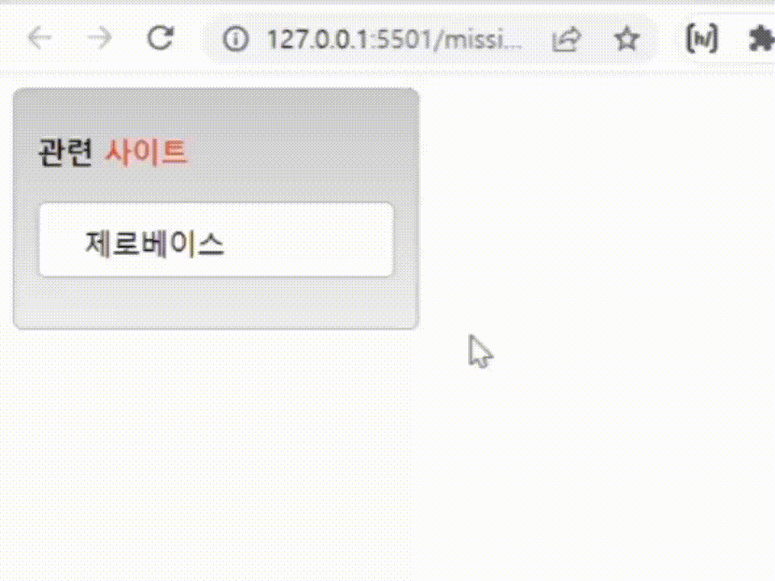

# 3차 과제 제출

## 결과


## 마크업 코드, 설명

### html 

```
div.bigBox   
 h1    
 ul.miniBox  
  li
   a 
  li
   a 
  li
   a 
  li
   a 
  li
   a 
```

### css
- h1 태그 내 일부 글자를 span 태그로 감싸 색을 바꿈
- .miniBox a 태그에 text-decoration:none;, color:black;으로 하이퍼링크를 자연스럽게 보이도록 함
- .miniBox에 height 설정, overflow: hidden;로 설정하여 제로베이스 글씨만 보이도록 함 
- .miniBox에 transition: height 1s, 1s ease; 애니메이션 효과를 줌 
- :hover 가상클래스를 이용해 마우스를 올리면 pointer로 바뀌고 height를 설정하여 펼쳐지는 효과 적용
