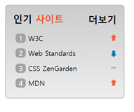

# 5차 과제 제출

## 결과


## 마크업 코드, 설명

### html 

```
div.site   
 h1 site__rank   
 ol.site__list
  li.splite.splite1
   span.list__number
    a.site__link
  li.splite.splite2
   span.list__number
    a.site__link
  li.splite.splite3
   span.list__number
    a.site__link
  li.splite.splite4
   span.list__number
    a.site__link
  a.site__more site__link 
```

### css
- .site에 linear-gradient를 이용해 자연스러운 그라데이션 효과를 줌
- .accentTitle를 이용해 특정 글자에 색을 바꿈
- ol 요소를 이용하여 list-style-type: none;을 설정하여 기본 숫자를 보이지 않도록 하고 span으로 감싸.list__number에 inline-block으로 설정하여 구현
- .splite에 background 이미지를 넣어n o-repeat;로 이미지 반복 방지
- 각각 이미지를 background-position: right;로 주고 스프라이트 기법으로 스타일링 